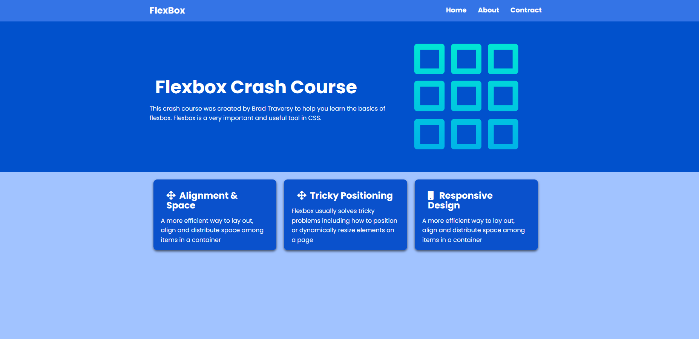

# Flexbox website Project

This is a simple website created with HTML and CSS
## Demo

## Features
-navbar
-header and section 
-card design

## Technologies Used
- HTML5
- CSS3

## How to Run
1. Download the project or clone the repository.
2. Open `index.html` file in your browser.

## Author
Abir Bhowmick
